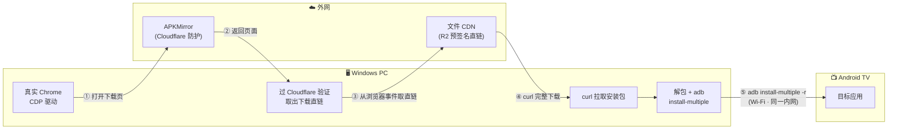

# Android TV APK 自动更新器

> 给**没有 Google Play** 的 Android TV 用（典型案例：国行 Sony BRAVIA）。
> 用**一台 Windows 电脑**，把「查版本 → 下载 → 安装 → 校验」整条链路自动化。
> **不需要 root、不需要 NAS、不需要在电视上装任何东西**——只要电视开着 ADB 网络调试。

**English**: An automated APK updater for Android TV devices that have no Google Play (e.g. China-market Sony BRAVIA). It drives a **real browser** to get past APKMirror's Cloudflare protection, picks the **correct ABI variant** (armeabi-v7a for 32-bit devices), then installs the bundle to the TV over **ADB over Wi-Fi** — all from a single PC.

---

## 为什么需要它

国行 Sony 电视没有 Google Play，应用只能侧载。传统手工流程是：

1. 打开 APKMirror 搜应用
2. 自己判断该下**哪个变体**（架构 / 最低系统版本 / DPI）
3. 下载到电脑
4. 想办法把包送进电视（U 盘、装推送工具、或手工 adb）

三个真实痛点：

| 痛点 | 具体表现 |
|---|---|
| **版本极易选错** | 同一个应用在 APKMirror 有 5～10 个变体，选错就装不上，报 `INSTALL_FAILED_NO_MATCHING_ABIS`。32 位设备只能用 `armeabi-v7a`，但页面上 `arm64-v8a` 版本号更显眼 |
| **没有 Google Play 就没有自动更新** | 每次都要把上面四步重做一遍，纯手工 |
| **脚本化访问被拦** | APKMirror 有 Cloudflare 机器人防护，`curl`、`wget`、headless 浏览器**一律 403**，导出 `cf_clearance` 给 curl 复用同样 403（绑定 TLS 指纹） |

本项目把这三件事都解决了。

---

## 它是怎么做的



### 关键点 1 · 用**真实浏览器**过 Cloudflare，而不是无头浏览器

实测：同一条网络下，`curl` 和 `--headless=new` 都被 Cloudflare 判定为机器人（返回 `Just a moment...` 或直接封禁页），
但**非无头的真实 Chrome** 能过。

两个坑：

- **不要**加 `--disable-blink-features=AutomationControlled` —— Chrome 会弹出
  「您使用的是不受支持的命令行标记」横幅，等于自曝。改用 CDP 的
  `Page.addScriptToEvaluateOnNewDocument` 注入脚本抹掉 `navigator.webdriver`。
- 验证码（Turnstile）的勾选框**位于一个闭合的 shadow root 里**，
  页面上 `document.querySelectorAll('iframe')` 返回**空数组**，纯 JS 永远点不到。
  必须走 CDP 的 DOM 域：

  ```text
  DOM.getDocument({depth: -1, pierce: true})   # pierce 能穿透 shadow root
    → 递归找 nodeName == 'iframe'
    → DOM.getContentQuads 取 viewport 矩形
    → 在 (x + 25, y + h/2) 派发真实鼠标事件（先 mouseMoved 再 press/release）
  ```

  实测 1～2 次点击、10～15 秒通过。

### 关键点 2 · **不要让浏览器下载**，把直链交给 curl

点开下载按钮后，Chrome 自己下载会在收到约 8～17 KB 后 `state=canceled`（换 profile 也一样，**不要去修它**）。

但从 CDP 的 `Browser.downloadWillBegin` 事件里能拿到真正的文件地址——是 CDN 的**预签名直链**：

```text
https://<hash>.r2.cloudflarestorage.com/downloadprod/.../<文件名>.apkm?X-Amz-Algorithm=...&X-Amz-Signature=...
```

这类地址就是为**程序化访问**设计的，直接：

```bash
curl -sSL -o <输出文件> "<该直链>"
```

即可完整下载（HTTP 200，大小与 APKMirror 标称一致）。

> **校验过**：自动下载得到的文件与人工在浏览器里下载的**同一文件，MD5 / SHA-256 完全一致**。
> 注意预签名 URL 有时效，拿到后要立刻下载。

### 关键点 3 · 按 **ABI + 最低 API** 精确选变体

APKMirror 的应用页里，权威信息在 `### <App> variants` 段落——每个变体下方紧跟一行
`Latest: [版本](链接) on 日期`。**这是判断"某个架构还有没有新版"的唯一可靠位置**；
页面顶部那张卡片的"最新版"只代表某一个变体。

选包规则：

```text
设备能力 = adb shell getprop ro.product.cpu.abilist     # 例如 armeabi-v7a,armeabi
变体要求 = 含设备支持的 ABI（32 位设备即含 armeabi-v7a）+ minApi <= 设备 API
```

- **双架构包（arm64-v8a + armeabi-v7a）可以装在 32 位设备上**，系统只会启用 v7a 分片。
  装完用 `dumpsys package <包名> | grep primaryCpuAbi` 应显示 `armeabi-v7a`。
- 一个 release 常有多个变体，URL 靠后缀区分，**后缀序号与变体行顺序一一对应**：
  ```text
  .../xxx-android-apk-download/       ← 第 1 个变体
  .../xxx-2-android-apk-download/     ← 第 2 个
  ```
  选错就装错架构或最低系统版本。

### 关键点 4 · PC 通过 ADB over Wi-Fi 直接安装

电视只要开着**网络调试**，PC 就能直接连上去装机，中间不需要任何中转设备：

```bash
adb connect <电视IP>:5555                  # 首次需在电视上点『允许 USB 调试』
unzip <包.apkm> -d <临时目录>               # .apkm/.xapk 本质是 zip
adb install-multiple -r <临时目录>/*.apk    # 更新已有应用必须加 -r
adb shell dumpsys package <包名> | grep -E 'versionName|primaryCpuAbi'   # 立刻回读校验
```

`tv_adb.py` 把这一串封装成了子命令，并内置了几处必须注意的细节：

- **adb 不用预装**：脚本按 `$ADB` → `PATH` → 本地 `.tools/` → 缓存 的顺序查找，
  都没有就从 `dl.google.com` 自动下载官方 platform-tools。
- **每次 adb 调用都要先 connect**：某些沙箱环境下 adb server 会随进程退出而重启，
  connect 状态不保留。脚本把「连接 + 操作」放在同一次执行里，不会出现 `device not found`。
- **`--slim` 剔除无关架构分片**：32 位电视上 `arm64_v8a` 分片永远用不到，可选剔除。
- **回滚用 `downgrade` 子命令**（自动加 `-d`），否则会报 `INSTALL_FAILED_VERSION_DOWNGRADE`。

---

## 适用机型

### 判据优先（任何型号都请实测，别凭型号推断）

本工具的硬性前提只有三条：

| # | 前提 | 怎么验 |
|---|---|---|
| 1 | 系统是 **Android TV / Google TV** | 电视上有应用商店、能装 APK（不是老式 Linux 智能电视） |
| 2 | 支持 **ADB 网络调试** | 设置 → 系统 → 关于 → 连点「版本」开启开发者选项 |
| 3 | CPU 架构含 **armeabi-v7a** | `adb shell getprop ro.product.cpu.abilist` |

**第 3 条最关键，也最容易踩坑**：很多电视的**芯片是 64 位，但系统跑的是 32 位用户空间**。
例如 Sony X90L/X91L 用的 MediaTek MT5895 是 64 位 Cortex-A73，但实测
`ro.product.cpu.abilist` 只有 `armeabi-v7a,armeabi` ——
这种设备**装不上纯 arm64 的包**，必须选含 `armeabi-v7a` 的变体（这正是本工具在做的判断）。

```bash
# 一条命令看清自己的设备
adb shell getprop ro.product.cpu.abilist
# armeabi-v7a,armeabi          → 32 位系统，选包必须含 armeabi-v7a
# arm64-v8a,armeabi-v7a,...    → 64 位系统，两种都能装
```

### 索尼国行 BRAVIA 型号清单（Android TV / Google TV）

索尼电视型号的**后缀字母 = 发布年份**。只要后缀对得上，就是同一代系统：

| 年份 | 后缀 | 国行主要系列（举例） | 系统版本 |
|---|---|---|---|
| 2015 | **C** | X8000C、X8300C、X8500C、X9000C、X9300C、X9400C | Android 5.0 |
| 2016 | **D** | X7500D、X8000D、X8500D、X8566D（京东「U90 系列」）、X9300D、X9400D、Z9D | Android 5.0 → 6.0 |
| 2017 | **E** | X7500E、X8500E、X8566E、X9000E、X9300E、X9400E、A1 | Android 7.0 |
| 2018 | **F** | X7500F、X8500F、X8566F、X9000F、A8F、Z9F | Android 7.0 → 8.0 |
| 2019 | **G** | X8000G、X8500G、X9500G、A8G、A9G、Z9G | Android 8.0 → 9.0 |
| 2020 | **H** | X8000H、X9000H、X9088H、X9100H、X9500H、A8H、Z8H | Android 9.0 |
| 2021 | **J** | X80J、X85J、X90J、X91J、X95J、A80J、A90J、Z9J | Google TV 10 |
| 2022 | **K** | X80K、X85K、X90K、X91K、X95EK、A80K / A80EK、A95K、Z9K | Google TV 10 / 11 |
| 2023 | **L** | X80L、X85L、**X90L / X91L**、X95EL、A80L / A80EL、A95L | Google TV 11 / 12 |
| 2024 | 数字系 | BRAVIA 7（XR70）、BRAVIA 8（XR80）、BRAVIA 9（XR90） | Google TV 12 |
| 2025 | 数字系 + **M2** | BRAVIA 5（XR50）、BRAVIA 3（S30）、BRAVIA 8II（XR80M2） | Google TV 12 |
| 2026 | 数字系 + **M2** | BRAVIA 9II（XR90M2）、BRAVIA 7II（XR70M2）、BRAVIA 3II（XR30M2）、BRAVIA 5系 64G（XR51） | Google TV 12 / 14 |

**几条要点：**

- **后缀字母记年份**：C=2015、D=2016、E=2017、F=2018、G=2019、H=2020、J=2021、K=2022、L=2023
  （**跳过 I**，避免与数字 1 混淆）。所以「85 英寸的 E 系列」= **2017 年**那一代。
- **带 `E` 的国行特供型号**（X95EK、A80EK、X95EL、A80EL 等）是国行渠道版本，与国际版同代。
- **2024 年起改用「数字系」命名**：BRAVIA 7 / 8 / 9，之后是 7Ⅱ / 8Ⅱ / 9Ⅱ。
- **型号前缀**：官网商城用 `K-`（如 `K-65XR90M2`），历史机型用 `KD-`（如 `KD-65X8500D`）。
- ⚠️ **2015–2018 的老机型（Android 5–8）不建议跑本流程**：系统过旧，主流流媒体应用早已停止支持。
  **建议 2019 年（Android 9）及以后**的机型使用。

> **结论：上表里的型号都是 Android TV / Google TV，都能用本工具。**
> 国行机型全部没有 Google Play，这正是需要它的原因。
> （选包规则统一按下面「关键点 3」走：**选含 `armeabi-v7a` 的变体**，双架构包也没问题。）

> **X91L 就是 2023 年的 X90L 系列**（国行版本，存储 4+64GB）。
> ⚠️ **中国大陆国行索尼电视全部不预装 Google Play / GMS**（政策原因，与型号无关）——
> 这正是需要本工具的典型场景，也正因如此，**国行机型是这套流程最主要的适用对象**。
> 国际版机型自带 Play 商店，但若要装 Play 上没有的 APK，同样可以用本工具。

### 已实测确认

| 型号 | 平台代号 | 系统 | `abilist` | 状态 |
|---|---|---|---|---|
| 65X91L（X90L 系列，2023，国行） | `BRAVIA_VH22` | Android 12 (API 31) | `armeabi-v7a,armeabi` | ✅ 全流程验证通过 |

> **不限于索尼**。只要满足上面三条判据，其他品牌的 Android TV / Google TV
> （小米、雷鸟、TCL、海信等）同样适用——已有多方实测反馈这类电视系统也普遍是 32 位。

---

## 环境要求

| 组件 | 要求 | 说明 |
|---|---|---|
| Android TV | Android 9+ | 需开启 **ADB 网络调试**（开发者选项） |
| 电脑 | Windows + Chrome | 负责过验证、取直链、解包、adb 安装 |
| 网络 | 能访问 `apkmirror.com` | 出口 IP 若被 Cloudflare 封，本项目的方法依然可用（它绕的是**客户端指纹**不是 IP） |
| Python | 3.9+ | 只用标准库，无需额外依赖 |

**不需要**：root、Google Play、NAS、在电视上安装任何 App。
**前提**：PC 与电视在**同一内网**（能 ping 通即可；内网地址不受代理软件影响）。

---

## 快速开始

### 1. 导入 Skill

把本仓库 `skills/` 下的两个目录复制到 WorkBuddy 的 skills 目录：

```text
%USERPROFILE%\.workbuddy\skills\
├── bravia-apk-update\      ← 主：下载 + 安装全流程
└── apk-version-inspect\    ← 辅：纯 Python 读 APK 版本号（无需 aapt）
```

### 2. 配置电视地址

复制 `skills/bravia-apk-update/config.example.json` 为 `config.json`，改成你电视的地址：

```json
{
  "tv_addr": "192.168.1.20:5555"
}
```

也可以用环境变量 `TV_ADDR`（优先级：`config.json` > `TV_ADDR` > 脚本内置默认值）。
`config.json` 已被 `.gitignore` 排除。

### 3. 首次连接电视

```bash
python skills/bravia-apk-update/scripts/tv_adb.py connect
```

- 电视上会弹出**「允许 USB 调试吗？」**，点**允许**并勾选**「一律允许来自这台计算机」**。
- 只需授权一次，之后永久生效。
- 失败时 `adb devices` 会显示 `unauthorized`，此时照着上面的提示去电视上点一下即可。

### 4. 使用

```bash
PY=python
TV=skills/bravia-apk-update/scripts/tv_adb.py

# ① 看电视上各应用的当前版本与 ABI
$PY $TV verify

# ② 下载新版（清单是 [{"name":"...","url":"<...-android-apk-download/"}）
$PY skills/bravia-apk-update/scripts/am_download.py targets.json ./downloads

# ③ 装到电视（自动解包 + install-multiple -r + 回读版本）
$PY $TV install ./downloads/*.apkm --slim
```

也可以直接交给 WorkBuddy：说一句「**检查电视上的应用有没有新版并更新**」，
它会自动完成「核对版本 → 下载 → 安装 → 校验 → 出报告」全流程。

> 建议把**检测**和**安装**分开：检测可以全自动（只列出有哪些新版），
> 安装前保留一次人工确认，避免哪天检测逻辑失效却无人察觉。

---

## 目录结构

```text
.
├── README.md
├── skills/
│   ├── bravia-apk-update/
│   │   ├── SKILL.md                    完整流程 + 全部实测坑
│   │   ├── config.example.json         配置模板
│   │   ├── references/
│   │   │   └── apkmirror-slugs.md      APKMirror 的 slug / 包名撞车 / 废弃列表坑
│   │   └── scripts/
│   │       ├── cf_pass.py              过 Cloudflare Turnstile（可独立使用）
│   │       ├── am_download.py          完整下载器（过验证 + 取直链 + curl）
│   │       └── tv_adb.py               PC 直连电视：安装 / 校验 / 截图 / 日志 / 转发
│   └── apk-version-inspect/
│       ├── SKILL.md
│       └── scripts/apk_info.py
└── docs/
    └── 手册.md                       完整中文操作手册（含排障）
```

`tv_adb.py` 子命令：

| 命令 | 作用 |
|---|---|
| `connect` | 连接电视并打印型号 / 系统 / ABI |
| `verify [包名…]` | 列出各应用的 `versionName` + `primaryCpuAbi` |
| `install <包>… [--slim] [--dry-run]` | 解包 → `install-multiple -r` → 回读版本 |
| `downgrade <包>…` | 降级安装（回滚用，自动加 `-d`） |
| `shot out.png` | 截图（自动唤醒） |
| `log <包名> [秒数]` | 按 PID 抓该应用日志 |
| `forward <本地口> <电视口>` | 端口转发 |
| `apps` | 列出电视上所有第三方应用 |

---

## 常见坑速查

| 坑 | 表现 | 正确做法 |
|---|---|---|
| 用 curl / 无头浏览器抓 APKMirror | 403 / `Just a moment...` | 用**非无头**真实 Chrome + CDP |
| 加 `AutomationControlled` 反检测参数 | Chrome 顶部弹「不受支持的命令行标记」 | 改用 `Page.addScriptToEvaluateOnNewDocument` 注入 |
| 验证码点不到 | `querySelectorAll('iframe')` 返回空数组 | 走 `DOM.getDocument(pierce:true)` + `getContentQuads` |
| 把 `cf_clearance` 导出给 curl | 仍然 403 | 不可行，它绑定 TLS 指纹 |
| 让浏览器自己下载 | 收 8～17 KB 后 canceled | 取 `Browser.downloadWillBegin` 的 URL 交给 curl |
| 装错架构 | `INSTALL_FAILED_NO_MATCHING_ABIS` | 选包前先 `getprop ro.product.cpu.abilist` |
| 更新已有应用 | `INSTALL_FAILED_ALREADY_EXISTS` | `install-multiple` **加 `-r`** |
| 降级安装 | `INSTALL_FAILED_VERSION_DOWNGRADE` | 加 **`-d`**（用 `tv_adb.py downgrade`） |
| 首次连接电视 | `unauthorized` | 去电视点『允许 USB 调试』+『一律允许』（只需一次） |
| 每次 adb 调用都 `device not found` | 连接状态丢失 | adb server 随进程重启 → **connect 与操作必须同进程**（脚本已处理） |
| `dumpsys \| grep -m1` | `Failed to write ... Broken pipe` | **无害**，是 grep 提前关管道 |
| 截图得到 0 字节 | 文件为空 | 电视上多半正显示**系统对话框**，系统禁止对其截屏 |
| 按包名 grep 日志 | 把别的进程的报错当成目标应用的 | **按 PID 过滤**：`pidof <包名>` 再 `grep "( PID)"` |
| 在电视 shell 里发 HTTP 请求 | 电视**没有 curl / wget** | `tv_adb.py forward 17890 7890` 转发到 PC 再 curl |
| 误判「更新把应用弄坏了」 | — | **回滚到上一版实测 + 截图比对 MD5**，再下结论 |

### 应用更新后打不开怎么办

先做**回滚对照**：装回上一版，看是否报同样的错。

```bash
python skills/bravia-apk-update/scripts/tv_adb.py downgrade <旧版.apkm>
```

若报错**完全相同**（截图 MD5 一致）→ **与应用版本无关**，去查网络 / 账号。
若报错不同 → 才回去查是不是变体选错了。

再往下查：按 PID 过滤日志、截图取证、以及用 `adb forward` 把电视上的代理端口转发到 PC
做对比测试（区分「网络路径坏了」和「服务端判定问题」）。

> 实战案例：某应用报「无网络连接」，实测新旧版本报错一模一样，且网络路径完全通畅，
> 最终定位是**出口 IP 的地区判定**——换成同服务主力区的节点即可。
> **结论：这类网络报错不要靠反复重装 APK 去解决。**

---

## 已知限制

- **依赖 APKMirror 的页面结构和 Cloudflare 策略**。任何一方变化都可能让流程失效，属于这类工具的固有脆弱性。
  建议把「检测」和「安装」拆开：检测可全自动，安装保留一次人工确认。
- **下载环节需要一个有图形界面的环境**（真实 Chrome）。目前验证过 Windows；Linux 上可能需要
  `xvfb` 跑"有头"Chrome，**未验证**。
- **只覆盖 APKMirror 上有的应用**。开源/独立应用（Clash Meta、SmartTube、Kodi、VLC 等）
  建议直接从 **GitHub Releases** 取，不需要过 Cloudflare，链路简单得多。
- **不处理签名不匹配的情况**。若目标应用原本来自 Google Play，侧载同包名的第三方构建会因签名不同而失败。
- 本工具只做「下载 + 安装」，**不修改、不破解任何应用**，也不绕过任何付费或地区限制。

---

## 免责声明

本项目仅用于**在自有设备上安装/更新应用**的自动化。请遵守：
- 各应用服务的使用条款
- 你所在地区的法律法规
- 仅从**官方或可信渠道**获取安装包

APK 文件版权归各自开发者所有。**请勿用本工具分发或转售他人应用。**

---

## License

[MIT](LICENSE) © 2026 l39881035-star
